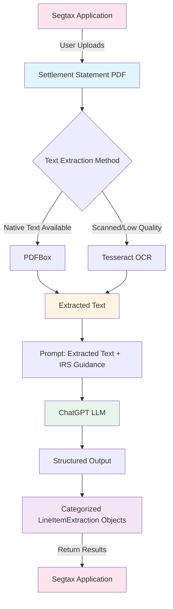

## Table of Contents

- [The Domain: Saving Money on Taxes by Real Estate Itemization](#the-domain-saving-money-on-taxes-by-real-estate-itemization)
- [The Problem: Not Everything is Automated (yet)](#the-problem-not-everything-is-automated-yet)
- [The Opportunity: "There's Data In Them There PDFs"](#the-opportunity-theres-data-in-them-there-pdfs)
- [Extracting Text from the PDF](#extracting-text-from-the-pdf)
- [Identifying Line Items from Extracted Text](#identifying-line-items-from-extracted-text)
- [Turning Extracted Text into Structured Output](#turning-extracted-text-into-structured-output)
- [Actually Using the Structured Output](#actually-using-the-structured-output)
- [The Humans in the Loop](#the-humans-in-the-loop)
- [Wiring It Up](#wiring-it-up)
- [The Efficiency Gain](#the-efficiency-gain)
- [Monitoring Pipeline Accuracy and Efficiency](#monitoring-pipeline-accuracy-and-efficiency)
- [The Takeaways](#the-takeaways)

### The Domain: Saving Money On Taxes By Real Estate Itemization

I had the pleasure of working with [Segtax](https://www.seg.tax/), a very cool startup that is modernizing the way cost segregation studies are done. 

What's a cost-segregation study? Well, [it's a little complicated](https://en.wikipedia.org/wiki/Cost_segregation_study/), but for our purposes, we can think of it this way:

By itemizing the things that make up a piece of real estate (ex: cabinetry, flooring, electrical wiring), we can save the owner of that property money on their taxes. The output of this, the cost segregation study, is a report of these itemizations that gets submitted to the IRS. 

Traditional cost segregation studies are done manually and are thus costly to produce, both in time and money. 

Instead, by automating crucial aspects of the cost segregation process, Segtax makes it cheaper and faster and more attainable. 

But in order to do this, many documents of all shapes, sizes and purposes must be reviewed, processed and synthesized. This all happens internally with Segtax's proprietary software. The output of all of this magic is the Cost Segregation Study PDF that is delivered to the customer.

### The Problem: Not Everything is Automated (yet) 

This is where we come in. 

One of the documents that needs to be processed, the Settlement Statement.

What's a Settlement Statement? Good question: It's a Statement representing a Settlement. Got it?

But really, its essentially one big receipt representing a real estate purchase. 

These settlement statements are made up of line items which represent things like taxes owed, credits due or fees paid. Different categories of line items impact the cost segregation study in different ways.

The problem is that these documents are still being read with slow human eyes and interpreted by distractable human brains. 

Our mission:

>*Whenever a Settlement Statement is uploaded to the system, extract, categorize and persist the line items within it*


### The Opportunity: "There's Data In Them There PDFs"

If we can dig the line items out of the Settlement Statement PDFs and process them into something the Segtax system can use automatically, then we're golden.

Now that we know what a cost segregation study is and how the line items within a settlement statement are used within one, we can start planning our line item extraction.

For this automation, we'll need a few things.

#### What We Need

1. Something to extract the text of the settlement statement PDF
2. Something to identify the line items from the extracted text
3. Something to categorize the extracted line items

> **Note:** Because modern AI providers like ChatGPT also [include OCR capabilities](https://platform.openai.com/docs/guides/pdf-files), in some cases, all 3 steps above could be combined into 1. However, if the PDF we are extracting data from was scanned in manually from a physical document and / or the quality was lacking, these tools would often be unable to process it.
>
> By extracting the text first via our own OCR instance, and then passing the extracted text to our LLM of choice, we were able to get consistent results while gaining more control and insight into the extraction process. 

### Extracting Text from the PDF 
To extract data from any Settlement Statement we throw at our automation, we'll need two things, [Apache PDFbox](https://pdfbox.apache.org/) and [tesseract](https://github.com/tesseract-ocr/tesseract).

These two libraries handle extracting text in two different ways.

PDFBox extracts "native" text directly from the PDF file itself. 

However, native text is often not available, like in the case of manually uploaded, crooked or blurry physical documents. For these PDFs, we fall back to tesseract, which uses nifty machine learning to extract text from the scanned images that comprise the PDF. 

So, in practice, to extract the text, we first check if we can extract the text natively and if we can't, we then fall back to OCR.


### Identifying Line Items from Extracted Text
This is difficult because the Settlement Statements themselves are not normalized in structure, as you can see below

<figure class="carousel-container" data-carousel-id="settlement">
  <div class="carousel-wrapper">
    <div class="carousel-slides">
      
      
      
    </div>
  </div>
  <figcaption class="carousel-caption">Example Settlement Statements</figcaption>
</figure>

To remedy this, we use prompting to tell the LLM what we _can_ expect from the text. 

Something like ...

>  *The document displays both buyer and seller debits and credits as columns, and the extracted text should reflect this* 

While prompting the LLM in this way with the raw, extracted text is certainly not as accurate as something like using custom [bounding box identification](https://nanonets.com/blog/ocr-with-tesseract/) to categorize the text within the PDF *before* extraction , it does have the benefit of working consistently every time because we are less reliant on said PDF pre-processing step. 

For example, in order for bounding box identification to work effectively, we need a few things:

1. The ability to know beforehand all potential configurations of the bounding boxes that may exist on any given uploaded settlement statement. 

    *For example, configuration A may have Seller on the right, configuration B has seller on the left and configuration C may have no seller, buyer only*

2. The appetite to find and codify said configurations.
3. A certain level of consistency in the image quality of the PDFs being uploaded.

#1 and #3 would prove difficult to solve. 

#2...well, this extraction pipeline was a PoC, so I chose definitely-working-well over maybe-eventually-working-optimally. We could always revisit.

Finally, since in practice, we only fall back to OCR text extraction around half the time, the pre-processing bounding box step was backlogged in favor of prioritizing a working PoC

### Turning Extracted Text into Structured Output 

ChatGPT's structured outputs are features in the API that force the model to return data in a specific, predefined format, like a JSON object, ensuring it conforms to a developer-supplied schema for reliable integration into applications, eliminating the need for manual parsing and retries. 

Again, in our case, we want to extract line items representing the closing costs of the real estate we are executing a cost segregation study. Let's call them `LineItemExtractions`

Segtax has a Spring backend written in Kotlin, so our `LineItemExtraction` class is a Kotlin class like this:

```kotlin
package com.seg.tax.segregator.agents.tools.pdf.model

import com.fasterxml.jackson.annotation.JsonIgnoreProperties
import com.fasterxml.jackson.annotation.JsonPropertyDescription
import com.seg.tax.segregator.agents.tools.pdf.model.taximplications.BasisImpactType
import java.math.BigDecimal

@JsonIgnoreProperties(ignoreUnknown = true)
data class LineItemExtraction(
    @JsonPropertyDescription("The text of the line item as it appears on the settlement statement")
    val raw_text: String,
    @JsonPropertyDescription("The amount of the line item")
    val amount: BigDecimal,
    @JsonPropertyDescription("'seller' or 'buyer'")
    val debitTo: String? = null,
    @JsonPropertyDescription("'seller' or 'buyer'")
    val creditTo: String? = null,
    @JsonPropertyDescription("The category of this line item as it pertains to the buyer")
    val category: ClosingCostCategoryDomain,
    @JsonPropertyDescription("On a scale of 1 to 10, how confident you, the LLM, are in the accuracy of this line item")
    val confidence: BigDecimal,
    @JsonPropertyDescription("An explanation of why the confidence score was scored that way")
    val confidenceExplanation: String,
    @JsonPropertyDescription("The dollar amount that affects the property's tax basis. Use 0 if there is no impact on basis.")
)
```

Here, we use the `@JsonIgnoreProperties(ignoreUnknown = true)` annotation to tell ChatGPT use *only* properties in this class in the response. This is something I incorrectly assumed to be default behavior, so it's worth calling out this annotation specifically. 

The `@JsonPropertyDescription` annotation gives ChatGPT a description of the property.

These annotations are some of the main levers we're going to pull as we iterate and test this pipeline. Tweaking the property descriptions and names can drastically effect the way ChatGPT interprets the text we supply it.

### Actually Using the Structured Output 

You may have noticed a property `ClosingCostCategoryDomain` above. 

That's what we're _really_ after. Extracting the text and mapping it to a JSON object consistently only gets us halfway to value-town. 

Now, we're going to put ChatGPT's big ole brain to work, and ask it to reason about the line items it just extracted.

Remember, before our automation, these line items were being categorized manually by users in Segtax's application. 

These enumerated categories are what key off deterministic flows downstream in the Segtax application and directly impact the "tax basis", AKA the "total cost of acquiring an asset".

This is where the probabilistic world of LLM reasoning meets the deterministic world of application logic. This enum is where our automation effectively [crosses the rubicon](https://en.wikipedia.org/wiki/Crossing_the_Rubicon).

Without further ado, the abridged `ClosingCostCategoryDomain` enum class:

```kotlin
enum class ClosingCostCategoryDomain(
    val id: Long,
) {
    PURCHASE_PRICE(1),
    ABSTRACT_FEES(2),
    INSTALLATION_OF_UTILITIES(3),
    LEGAL_FEES_AND_TITLE_FES(4),
    RECORDING_FEES(5),
    SURVEY(6),
    TRANSFER_TAXES(7),
    OWNERS_TITLE_INSURANCE(8),
    BACK_TAXES_INTEREST_MORTGAGE_FEES_CHARGES_FOR_REPAIRS_SALES_COMMISSIONS(9),
    ACQUISITION_FEES(10),
    // ... etc
}
```

#### Let's recap:

Now you know how we extract text from the PDF, 



### The Humans in the Loop
When designing a system like this, it's crucial to get the domain expert's feedback early and often. To do this, I used Anthropic's Claude to generate static html pages that displayed the PDF on one side and the extracted line items on the other.

This way, with each run of the extraction pipeline, I could bother the domain expert in various ways and ask them to review the categorizations made for the extracted line items, just by sending them an html file to open in their browser.

This much more easier than setting the automation up to run on their machine or having them toggle between Preview and a JSON blob.

However, I found it easy to get bogged down in this step, as it was hard to define a stopping point for all of the tinkering it begets. 

After much tweaking of the various knobs at our disposal -- the prompt verbiage, the ChatGPT model, the shape of the structured output and the description of properties within it's classes -- we eventually settled on a prompt, a model and `LineItemExtraction.kt` file.

In hindsight, this was probably the hardest step of the whole project. 

If I could go back, I would go into this step with more of a plan. I would have defined some metrics to shoot for, and I would have defined the problem space explicitly with the domain experts _before_ asking them to start reviewing first passes.

### Wiring It Up

Now, when an internal Segtax user uploads a Settlement Statement as part of conducting a cost segregation study, we kick off an extraction pipeline that:

1. Reads the PDF
2. Extracts the Line Items from the PDF
3. Categorizes the Line Items in the PDF into one of several predefined categories

But what do do with this newly extracted and categorized data?

Use it, duh!

Inside our Spring application, with `Controller`, `Service`, `Repository` classes and async Task handling logic for our newly extracted data, we can now fully integrate the output of our automatic, AI-powered Settlement Statement processing into our backend.

Now, in the UI, the possibilities are limited only by the imagination of the product designer.  

For our use case, after the line items were extracted from a document, we then presented the results to the user in the UI as an editable list of line items alongside the PDF. 

In this way, we ensure the human closes the loop and ultimately remains responsible for the data stored.

### The Efficiency Gain

Categorizing each line item in a Settlement Statement is something that would take, on average, roughly 30 minutes per document. Now, it's now a background task that completes in roughly 5. 

While it's tempting to say that you get 25-30 minutes back per document, the reality is that it still takes time to review and update.

Depending on the complexity of the Settlement Statement, my testings with the domain experts found the categorizations of the line items to be anywhere from 70-100% accurate depending on the complexity of the Settlement Statement. 

Extractions that didn't require any reasoning, like the text of a line item description or the number associated with it, was essentially 100%.

That means that after a user uploads a Settlement Statement, all that is left for a user to do is to _review_ data rather than read, interpret, and input it.

### Monitoring Pipeline Accuracy and Efficiency

Not only do we store the entity data in our database -- as in, the data that gets updated by a user -- but we *also* store a snapshot of the original LLM extraction in it's own table. 

This way, if we do end up changing the category of a line item, we can see which prompts or models are having trouble extracting the data, allowing us to continuously improve our pipeline via observability. 

This essentially unlocks some rudimentary internal benchmarking, allowing us to continuously iterate on our extraction pipeline.


### The Takeaways
