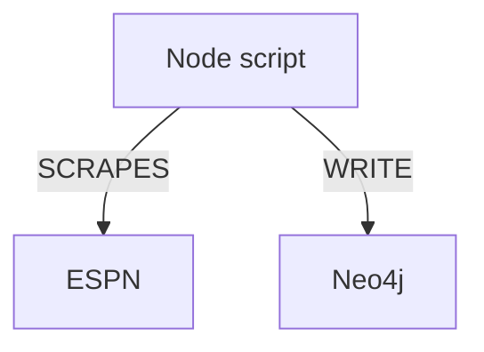
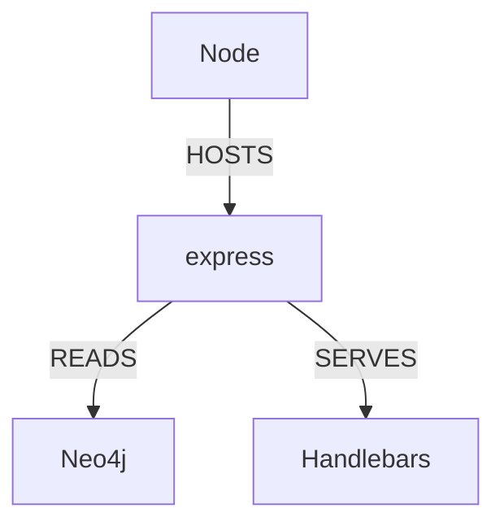

<figure>
  
</figure>


### The Use Case: Finding my Tier 3 WRs
It was the summer of 2019 and I was preparing for yet another fantasy football draft.

I take these pretty seriously, so I was making my own tiered rankings of WRs.

Tiers 1 and 2 are pretty straightforward — everybody knows the studs. But tiers 3 and 4 are trickier.

Tiers 3 and 4 are where championships are won. Where smack can be talked. This is also where I hit a wall, the same one I hit every year.

“Show me all WR seasons with between 70 and 100 receptions over the last 3 seasons”

My journey begins with that simple question.

I wanted to do something that I assumed would be straightforward.

I wanted to create my own definition of what a 3rd tier WR was and then go find and rank them. I didn’t simply want to look at a list of the “top” 24-36 WRs, ranked by last year’s fantasy output.

I wanted to find my own grinders. I wanted high floor, low ceiling, guys. Blue collar WRs. Consistent, known commodities.

So I went about my merry way and looked for a website which would help me find and rank these guys.

### The Problem: NFL Stats are hardcoded

Instead, I found a cacophony of opinions (wrong ones, of course) manifested into static, paywalled and often outdated lists.

The data was out there, it was just wasn’t searchable or centralized. I couldn't find anything that supported my stats-first, player-second way of thinking.

Most of the data was already curated for me. I didn’t want that.

There were a few options that allowed me to actually search for the data I was after, but they had either steep learning curves or cost-prohibitive paywalls.

Yet I still needed to validate my own (always correct) opinions with my own queries.

I needed to find the statistical nugget that would give me an edge or a heuristic so potent that I could put it to work 2 hours and N beers deep into draft night.

Ah yes…Kenny Golladay, bring me victory.

### The Solution: Search Engine for Stats
I immediately began scraping stats from ESPN.

I cracked open the dev console, took a peak at which routes were returning the JSON that I was after, and wrote a simple node app to loop through a list of ESPN playerIds and scrape the data. I don’t remember where I found a list of ESPN playerIds, but once I did, I was off and scrapin’.

As the data was being scraped, I was shaping it and writing it to a local Neo4j graph database instance.

#### The "Graph" to support my specific use case

<figure>
  
  <figcaption style="font-size: 0.9em; color: #666; margin-top: 0.3em; text-align: center;">
  </figcaption>
</figure>

#### Data Ingestion - Simple 


#### Website


Now with the stats in a graph, I could query the Neo4j instance in ways not traditionally supported by relational databases, giving the user extra flexibility by natively supporting things like “multi-hop” queries.

> “Show me all WRs who ran a 40 yard dash over 4.5 seconds and have scored a TD against an Ed Donatell coached defense during the playoffs”
 
 
 ```cypher
 MATCH (p:Player)-[cs:PARTICIPATED]->(:Combine),
        (p)-[gs:PLAYED_IN]->(g:Game)<-[:COACHED_IN]-(c:Coach)
  WHERE cs.40_yard_dash > 4.5
    AND gs.touchdown > 0
    AND c.name = "Ed Donatell"
    AND g.isPlayoff = true
  RETURN p
```

<figure>
  
  <figcaption style="font-size: 0.9em; color: #666; margin-top: 0.3em; text-align: center;">
    <em>A hypothetical graph supporting the "slow receivers who score against Ed Donatell in the playoffs" use case</em>
  </figcaption>
</figure>

Did I ever get around to properly supporting that killer use case? **No**. 

Did I build a useful tool nonetheless that worked and could have just as well been served by a traditional, non-graph datastore? **Yes**

I built **Fantasy Football Stat Factory**, a simple handlebars + express app that enabled the user to _search_ NFL player stats scraped from ESPN without needing to know how to scrape, clean or host any data.

Did I use it to find my WR3? I'm not sure to be honest. I think by the time I had finished it, the draft had gone by. But that's beside the point of this post...I think.

<figure>
  
  <figcaption style="font-size: 0.9em; color: #666; margin-top: 0.3em; text-align: center;">
    <em>Medcalf Software Solutions does not condone the design of this SIX YEAR OLD, locally hosted website</em>
  </figcaption>
</figure>

---

### The Next Phase: The Factory of Sadness

Quickly after I stood up this solution, I let it die a slow and silent death.

I would run the scraper here and there, but work and life got in the way, and this app gathered dust on the shelf for years.

Then, after years of nothing but automated, dependabot-induced breaking changes, something happened.

*ChatGPT 3.5 was released...*

--- 

Stick around for Part 2 in our StatFoundry series. Tentatively titled "Peyton Manning: The Meanest Quarterback in the NFL"

