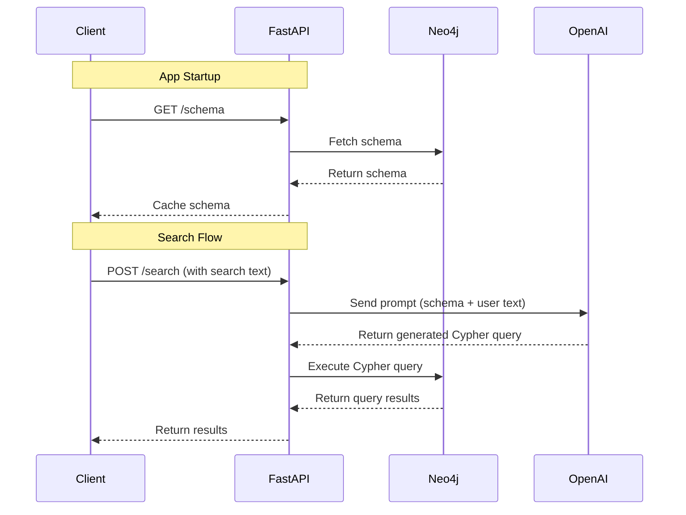

### The New Direction

It is April, 2025. Everyone at work is now using ChatGPT, for better or for worse, including myself.

Unwinding after a long day of work spent deciphering whether important pull requests or innocuous teams messages were authored by either ChatGPT or a human, I turned on the the NFL draft and quickly had an epiphany.

Probably the least unique or interesting epiphany one can have in 2025. Sorry, I know you've had it to.

> "What if just had ChatGPT to do it for me?"

"It", of course, being the hard work of bringing my beloved, decrepit [Fantasy Football Factory](statfoundry-part1) back to life, so it can finally meet it's fullest, graph native potential.

What if I could just tell ChatGPT what I wanted from the NFL knowledge graph I had been building?

Would it then just... write the perfect Cypher query?

### Introducing: The Fantasy Football Oracle

Fueled by the possibilities that an LLM could bring to my abandoned passion project, I sketched up a UI one night. The world was my oyster.

<figure class="carousel-container" id="fforacle-carousel">
  

    

      
      
      
      
      
      
      
    

  

<button class="carousel-btn carousel-prev" onclick="moveCarousel('fforacle', -1)" aria-label="Previous image">‹</button>
<button class="carousel-btn carousel-next" onclick="moveCarousel('fforacle', 1)" aria-label="Next image">›</button>

  

    <button class="indicator active" onclick="goToSlide('fforacle', 0)" aria-label="Go to slide 1"></button>
    <button class="indicator" onclick="goToSlide('fforacle', 1)" aria-label="Go to slide 2"></button>
    <button class="indicator" onclick="goToSlide('fforacle', 2)" aria-label="Go to slide 3"></button>
    <button class="indicator" onclick="goToSlide('fforacle', 3)" aria-label="Go to slide 4"></button>
    <button class="indicator" onclick="goToSlide('fforacle', 4)" aria-label="Go to slide 5"></button>
    <button class="indicator" onclick="goToSlide('fforacle', 5)" aria-label="Go to slide 6"></button>
    <button class="indicator" onclick="goToSlide('fforacle', 6)" aria-label="Go to slide 7"></button>
  

  <figcaption class="carousel-caption">
    The original Fantasy Football Oracle design. Type, Get Suggestions, Select, Repeat
  </figcaption>
</figure>

The idea was simple: "Google for football stats", with one important tweak.

Instead of executing a search when you select a suggestion, you can optionally just add the suggestion to your query to get more relevant suggestions.

#### The Search UX

1. Type something
2. Get Suggestions
3. Select a suggestion
4. Edit a suggestion <i>(optional: for numeric info like stats)</i>
5. Repeat
6. Search with the query you built via The Oracle's suggestions

The UX emulated a pattern I thought would be very familiar to anyone who has used Google.

So...everybody?

But I was getting way ahead of myself. I had to validate my idea before I built it.

### User Research: What Do People Actually Want?

I've always enjoyed user research.

I was lucky enough to spend most of my career on teams that took user research very seriously.

After seeing real users challenge everything you thought you knew about your own app during a 10 minute Zoom call, it becomes an essential part of any development process."

All that to say, I had a blast doing my own geurilla user testing on Instagram.

I asked the following 4 questions over the course of a couple days and got a not-insignificant amount of responses (30-50 per question). To increase feedback, the questions were about "Sports" statistics, not just "NFL".

1. Why are you typically looking up stats?
2. What kind of stats are you looking up, mostly?
3. How do you get your sports stats?
4. How easy is it to find the stats you are after?

<figure class="carousel-container" id="survey-carousel">
  

    

      
      
      
      
    

  

<button class="carousel-btn carousel-prev" onclick="moveCarousel('survey', -1)" aria-label="Previous image">‹</button>
<button class="carousel-btn carousel-next" onclick="moveCarousel('survey', 1)" aria-label="Next image">›</button>

  

    <button class="indicator active" onclick="goToSlide('survey', 0)" aria-label="Go to slide 1"></button>
    <button class="indicator" onclick="goToSlide('survey', 1)" aria-label="Go to slide 2"></button>
    <button class="indicator" onclick="goToSlide('survey', 2)" aria-label="Go to slide 3"></button>
    <button class="indicator" onclick="goToSlide('survey', 3)" aria-label="Go to slide 4"></button>
  

  <figcaption class="carousel-caption">
    Quick and dirty user research using Instagram Stories
  </figcaption>
</figure>

### Takeaway: Curious Lads use Google for basic stats

In hindsight, I thought this was a lot more validating for my Single Search Bar theory than it actually was.

- Yes, the single search bar was a familiar UX pattern
- Yes, people look up stats simply out of curiosity.

While this boded well for my design -- a simple Search Bar driven UX, I completely overlooked the slider that said _"You know, its not so bad actually"._

And more crucially, these weren't really the users I should target.

My goal was never to build for the "Everyone Who Follows Me On Instagram" demographic.

But I had made up my mind. I was going to do this thing, and knowing that most people are simply Curious Lads who use Google was enough validation for me to build the Oracle.

<i>Authors note: Eventually, I moved off the "Oracle" branding. This was partially due to domain availability as well as the fact that "Oracle" is actually a pretty bad metaphor for what the app does, which is, drudge up the past, not predict the future. </i>

### From RAGs to Riches

I got my OpenAI API key and I was off.

Before I even knew what [RAG](https://en.wikipedia.org/wiki/Retrieval-augmented_generation) was, I had a dead simple, no frills RAG pipeline, injecting my Neo4j schema into my ChatGPT prompts.

It was really cool, even amazing, when it worked 80% of the time during my testing.

Even though I had provided it with the schema, noted in the prompt that the schema was _the only schema_ it had to work with, even though I knew the domain like the back of my hand, it still hallucinated nodes, relationships, and worst of all, my intent.

### User Testing

Now that the prototype was up and running, I asked a friend of mine try it out.

I'm glad I did, because the absurdity of the questions he'd ask revealed just how crazy it is to expect an LLM to be deterministic or even make sense.

The question that tore the wool from my eyes:

> "Who is the meanest quarterback in the NFL?"

### Peyton Manning - the MOAT

And sure enough, like the good little LLM it is, ChatGPT dutifully generated a cypher query despite all common sense.

I wish I could find the Cypher query that was generated, but I can tell you it was at least 40 lines long and had several aggregations.

I _think_ it interpreted "meanest" as "the most mean", AKA average.

Naturally it decided to determine who the most average quarterback in the NFL was by determining which QB has the highest average ("meanest") passing touchdowns, presumably over a season, but we can't quite really be sure.

It also did not once check for [unsportsmanlike conduct](https://www.youtube.com/watch?v=DttfyOeU3vw) penalties, arrests for violent behavior, or [press conference tirades](https://youtu.be/onLrDX83AyE?t=47).

I know this because I hadn't indexed that data (yet)

### Takeaways from User Testing

- Writing valid Cypher is only half the battle
- Users can't be expected to know how to formulate their questions for optimal results
- Edge cases are potentially infinite
- How do we guide users toward "askable" questions?
- Is Input Validation a thing?
- If there is a million ways to ask one question, then there is also a million ways to misinterpret it.
- At what point does the prompt engineering effort outweight the benefits of using an LLM?
- How do we balance flexibility with accuracy?
- How do we catch less obvious hallucinations?
- How do we validate the LLM's interpretation of the data?
- When should we reject a seemingly valid query?

### Next Stop: The Foundry

When they zig, I zag.

No more AI. Just chunks. And some other stuff.

Stick around for Part 3 where we build an Automated Schema Aware Deterministic Composable Query Builder DSL

Or _ASADCQBDSL_ for short.

I never said I was good at branding.

